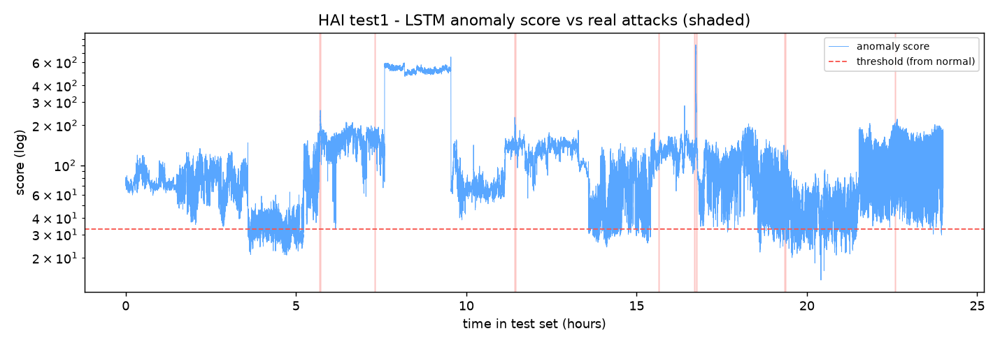
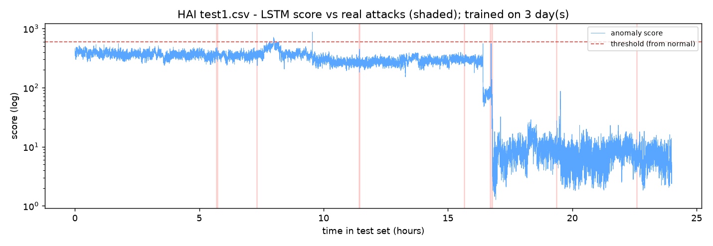

# External Validation on the Public HAI Dataset

Our LSTM detector was developed and evaluated on data from our own simulator
(see [results.md](results.md)). To test whether the approach generalises beyond
data we generated ourselves, we validated it on **HAI 22.04** (HIL-based Augmented
ICS dataset, National Security Research Institute, South Korea) — a real
hardware-in-the-loop testbed with boiler, turbine, water-treatment and HIL
processes, sampled at 1 Hz.

**Bottom line:** the LSTM layer does not generalise well to HAI. We ran two
pre-planned configurations:

1. **Trained on one recording (26 h)**, threshold from the training data: the score ranks
   attacks above normal better than chance (ROC-AUC 0.74), but the threshold
   flags ~94% of the test day, so it is unusable as an alarm.
2. **Trained on three recordings (117 h)**, threshold from a separate held-out
   normal recording: false
   alarms drop to ~0.1% of the day, but the score's ability to separate attacks
   from normal falls (ROC-AUC 0.59 with plain MSE, 0.47 with our per-feature
   score). The best deployable result is plain MSE, which detects **2 of 7**
   attack episodes at 26% precision with a median delay of 45 s.

The strong simulator results should therefore be read as optimistic, and this is
reported as a limitation. The main cause is that HAI's test day runs in operating
modes that do not appear in any of the training recordings.

## Setup

| | Round 1 | Round 2 |
|---|---|---|
| Training data (normal only) | `train1` (26 h) | `train1`, `train2`, `train3` (26 + 56 + 35 = 117 h) |
| Threshold set on | training windows | `train4` — a held-out normal recording (24 h), not trained on |
| Test data | `test1` — 24 h, 885 s of labelled attacks (~1%), 7 episodes | same |
| Features | 60 informative sensors/actuators (26 constant in `train1`, dropped) | 69 (17 constant across the three recordings, dropped) |
| Model | LSTM autoencoder, window 10 s, hidden 64, latent 32, 15 epochs, inputs clipped to ±5σ | same |
| Threshold rule | 99.9th percentile of normal scores | same |

Only the training recordings and the calibration source changed between rounds;
every model and threshold setting was held fixed. The feature set follows from the
training data (a sensor is kept if it varies during training), so Round 2 uses 69
sensors rather than 60. The difference between rounds comes from these changes.

Reproduce (after downloading the CSVs into `data/public/hai/`):

```bash
# Round 1
python -m eval.hai_validate
# Round 2
python -m eval.hai_validate \
  --train data/public/hai/train1.csv,data/public/hai/train2.csv,data/public/hai/train3.csv \
  --calib data/public/hai/train4.csv --tag multiday
```

## Results

Window-level, contamination-aware labels (a window is an attack window if any of
its seconds is an attack). Random-guess PR-AUC equals the attack base rate, 0.011.
"Deployable" means the threshold was set without looking at test labels.

### Plain mean-MSE score

| | Round 1 (1 recording) | Round 2 (3 recordings + held-out threshold) |
|---|---|---|
| ROC-AUC | 0.742 | 0.586 |
| PR-AUC | 0.081 | 0.055 |
| Deployable precision / recall | 0.012 / 0.978 | 0.259 / 0.045 |
| Deployable F1 | 0.023 | 0.077 |
| False-positive rate | 0.914 | **0.001** |
| Attack episodes detected | 7/7 *(meaningless — flags nearly everything)* | **2/7**, median delay 45 s |
| Best F1 with an oracle threshold *(uses test labels)* | 0.102 | 0.093 |

### Our per-feature standardised score

| | Round 1 (1 recording) | Round 2 (3 recordings + held-out threshold) |
|---|---|---|
| ROC-AUC | 0.742 | 0.465 |
| PR-AUC | 0.044 | 0.010 (≈ random) |
| Deployable precision / recall | 0.012 / 0.998 | 0.000 / 0.000 |
| False-positive rate | 0.940 | 0.002 |
| Attack episodes detected | 7/7 *(meaningless)* | 0/7 |
| Best F1 with an oracle threshold *(uses test labels)* | 0.057 | 0.025 |

The oracle rows are not achievable in practice; they are an upper bound on how
well each score could separate the classes if its threshold were perfectly set.

Round 1 timeline:



Round 2 timeline (our per-feature score):



## Diagnosis

1. **A near-constant sensor broke the very first attempt.** Without safeguards,
   Round 1 scored ROC-AUC 0.47. `P1_PCV02Z` has a training std of 0.0037, but on
   the test day its normal values sit a median of ~127σ from the training mean,
   and that one sensor dominated every window. Clipping standardised inputs to
   ±5σ — a conventional outlier bound, set before re-running — raised ROC-AUC to
   0.74. All reported results use this clipping.
2. **The held-out threshold fixed the false alarms.** Setting the threshold on a
   separate normal recording instead of the training data cut the false-positive rate
   from ~0.91 to ~0.001. This part of the plan worked as intended.
3. **More training data did not cover the test day's operating modes.** The
   Round 2 timeline shows the score sitting high for the first ~16.5 hours and
   then dropping about 50× at ~16.8 h, with no attack causing it. The plant is
   running in a mode that none of the three training recordings (or the
   calibration recording) contain. The score tracks these mode changes rather than the attacks,
   which are short events on top.
4. **Broader training data made attacks stand out less.** Scaling statistics
   computed over three recordings are wider, so a given deviation is smaller in
   standardised units, and the model learns to reconstruct more varied behaviour.
   Both reduce how much attacks stand out. ROC-AUC does not depend on the
   threshold, so its drop from 0.74 is caused by the training change, not the
   calibration change.
5. **Our per-feature score is fragile on real data.** It divides each sensor's
   reconstruction error by that error's spread during training. For sensors the
   model reconstructs almost perfectly, the spread is tiny, so a mode change in
   one of them produces a huge score — undoing the input clipping. This is why it
   collapses to chance in Round 2 while plain MSE degrades less. The same score
   worked on our simulator, where the operating conditions never change and the
   stealth attack affects a single signal; on HAI it is the wrong choice.

## Methodological note

Both rounds were planned before they were run, and each was run once. Between
them only the training recordings and the threshold source changed. We stopped after
Round 2 rather than continuing to adjust settings and re-checking against
`test1`: repeatedly tuning against the labelled test file would fit the model to
that file and make the validation meaningless.

## What would improve it (future work)

- **Cover more operating modes.** Train on all six HAI training recordings
  (`train5` and `train6` are unused) and check whether the test day's early operating mode
  appears in any of them.
- **Mode-aware normalisation.** Detect the plant's operating mode and normalise
  or score within each mode, so a mode change is not mistaken for an attack.
- **Score relative to a rolling baseline.** Attacks are short compared with mode
  changes; scoring the deviation from the last few minutes would target sudden
  changes and ignore slow shifts.
- **Use plain MSE (or a top-k average) rather than the worst-feature score** on
  real multi-sensor data.
- **Confirm on `test2`,** an independent test day, before trusting any
  improvement.
- **Report HAI's official metric (eTaPR)** to compare with published results.

## Implication for the project

The simulator evaluation shows the detection-in-depth architecture works as
designed when the attacks and operating conditions match what the models were
built for. The HAI validation shows that the LSTM layer, as currently designed,
does not handle a real plant whose operating mode changes from day to day: it
either raises constant false alarms (threshold from training) or misses most
attacks (threshold from a held-out recording). Handling operating-mode changes is the
main open problem for this layer. The DPI rule engine and NetFlow monitor were
not evaluated on HAI because HAI provides process data only, not network packets.
